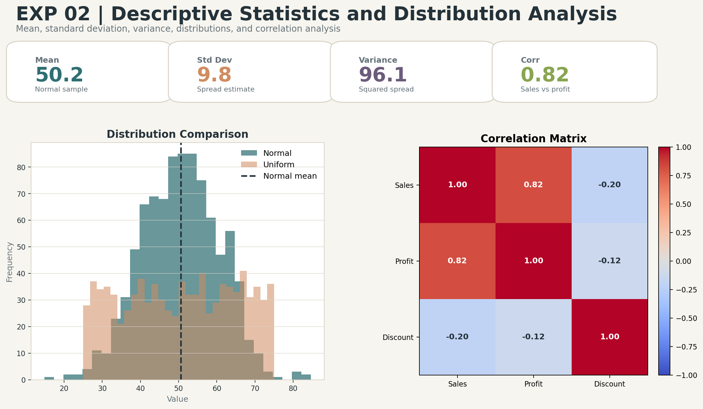

# Descriptive Statistics and Distribution Analysis

## Aim
Demonstrate mean, standard deviation, variance, normal and uniform distributions, and correlation.

## Dataset
Synthetic business dataset

## Professional Improvements
- Computes descriptive statistics from a reproducible dataset.
- Contrasts normal and uniform distributions visually.
- Exports correlation matrix and enhanced distribution dashboard.

## Enhanced Output Preview

## Files
- `code.ipynb`: Colab-ready implementation.
- `output.txt`: Expected console-style output.
- `results/`: Generated metrics, tables, and enhanced visual artifacts.

## How to Run
Open `code.ipynb` in Google Colab or Jupyter and run all cells from top to bottom. The notebook regenerates the files under `results/`.
