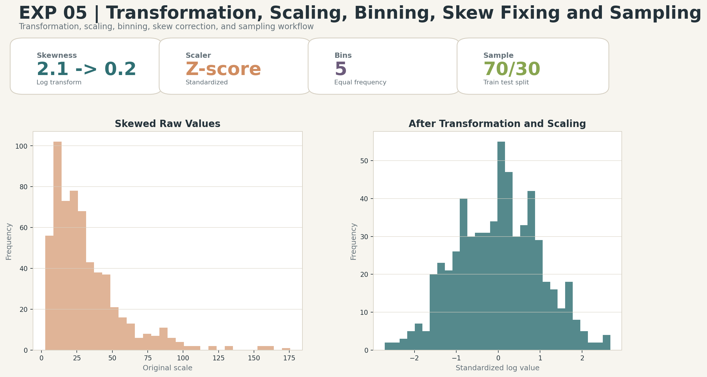

# Transformation, Scaling, Binning, Skew Fixing and Sampling

## Aim
Demonstrate transformation, feature scaling, binning, skew correction, and sampling.

## Dataset
Synthetic customer value dataset

## Professional Improvements
- Uses log transformation to reduce skewness.
- Applies standard scaling and quantile binning.
- Creates reproducible train-test samples.

## Enhanced Output Preview

## Files
- `code.ipynb`: Colab-ready implementation.
- `output.txt`: Expected console-style output.
- `results/`: Generated metrics, tables, and enhanced visual artifacts.

## How to Run
Open `code.ipynb` in Google Colab or Jupyter and run all cells from top to bottom. The notebook regenerates the files under `results/`.
