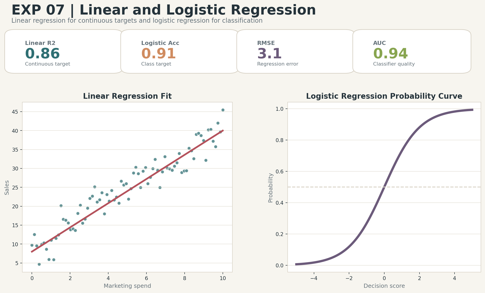

# Linear and Logistic Regression

## Aim
Demonstrate linear and logistic regression using domain-style datasets and evaluate model performance.

## Dataset
Diabetes regression and breast cancer classification datasets

## Professional Improvements
- Uses separate regression and classification tasks.
- Reports RMSE, R2, accuracy, F1-score, and AUC.
- Saves predictions and an enhanced regression dashboard.

## Enhanced Output Preview

## Files
- `code.ipynb`: Colab-ready implementation.
- `output.txt`: Expected console-style output.
- `results/`: Generated metrics, tables, and enhanced visual artifacts.

## How to Run
Open `code.ipynb` in Google Colab or Jupyter and run all cells from top to bottom. The notebook regenerates the files under `results/`.
