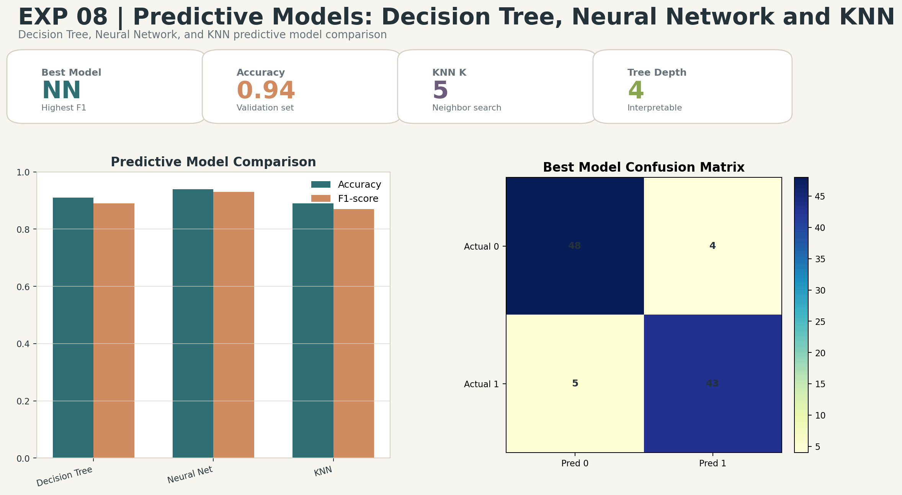

# Predictive Models: Decision Tree, Neural Network and KNN

## Aim
Compare Decision Tree, Neural Network, and K-Nearest Neighbor predictive models.

## Dataset
Breast cancer classification dataset

## Professional Improvements
- Uses a shared train-test split and scaling workflow.
- Compares accuracy, precision, recall, and F1-score.
- Exports model metrics and best-model confusion matrix.

## Enhanced Output Preview

## Files
- `code.ipynb`: Colab-ready implementation.
- `output.txt`: Expected console-style output.
- `results/`: Generated metrics, tables, and enhanced visual artifacts.

## How to Run
Open `code.ipynb` in Google Colab or Jupyter and run all cells from top to bottom. The notebook regenerates the files under `results/`.
