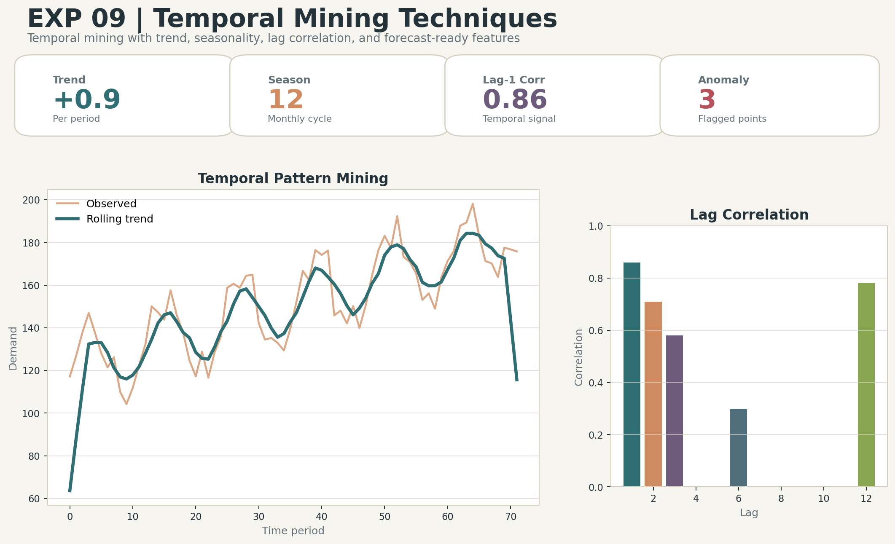

# Temporal Mining Techniques

## Aim
Demonstrate temporal mining using trend, rolling averages, lag features, seasonality, and anomaly detection.

## Dataset
Synthetic monthly demand time series

## Professional Improvements
- Creates trend and seasonal time-series patterns.
- Adds lag features and rolling statistics.
- Detects anomalies using rolling z-scores.

## Enhanced Output Preview

## Files
- `code.ipynb`: Colab-ready implementation.
- `output.txt`: Expected console-style output.
- `results/`: Generated metrics, tables, and enhanced visual artifacts.

## How to Run
Open `code.ipynb` in Google Colab or Jupyter and run all cells from top to bottom. The notebook regenerates the files under `results/`.
