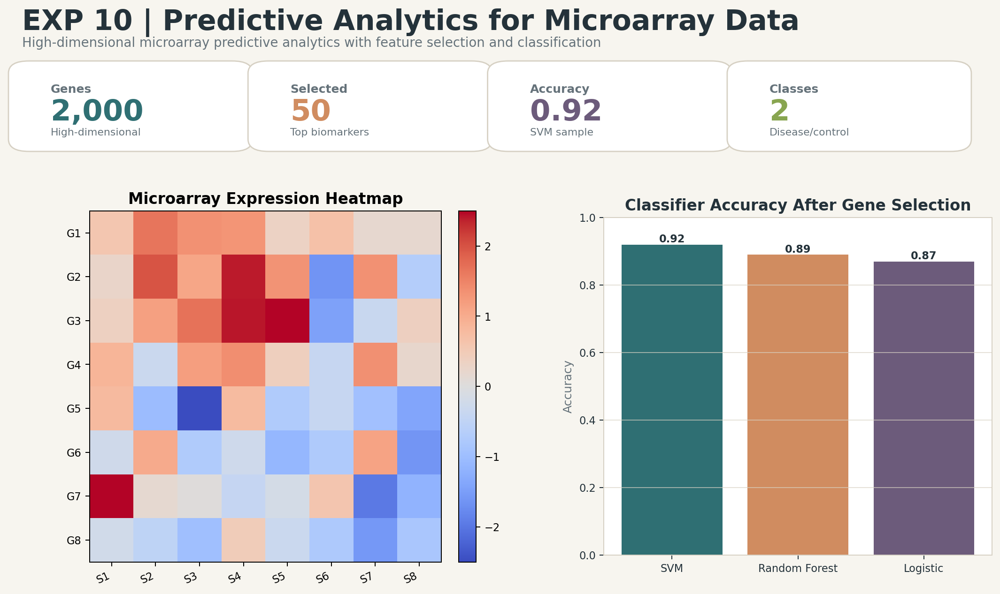

# Predictive Analytics for Microarray Data

## Aim
Analyze high-dimensional microarray-style data using feature selection and predictive classification models.

## Dataset
Microarray gene expression dataset or synthetic high-dimensional gene-expression sample

## Professional Improvements
- Simulates high-dimensional low-sample microarray conditions.
- Uses feature selection before classification.
- Exports selected genes, model metrics, and expression heatmap.

## Enhanced Output Preview

## Files
- `code.ipynb`: Colab-ready implementation.
- `output.txt`: Expected console-style output.
- `results/`: Generated metrics, tables, and enhanced visual artifacts.

## How to Run
Open `code.ipynb` in Google Colab or Jupyter and run all cells from top to bottom. The notebook regenerates the files under `results/`.
