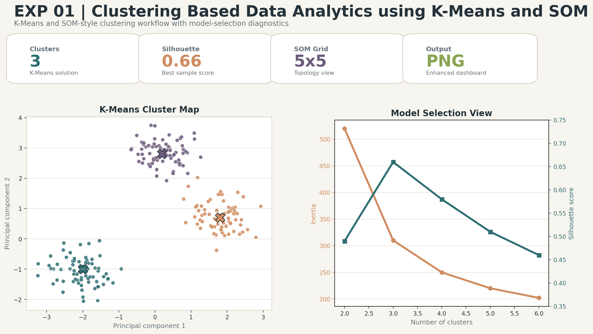
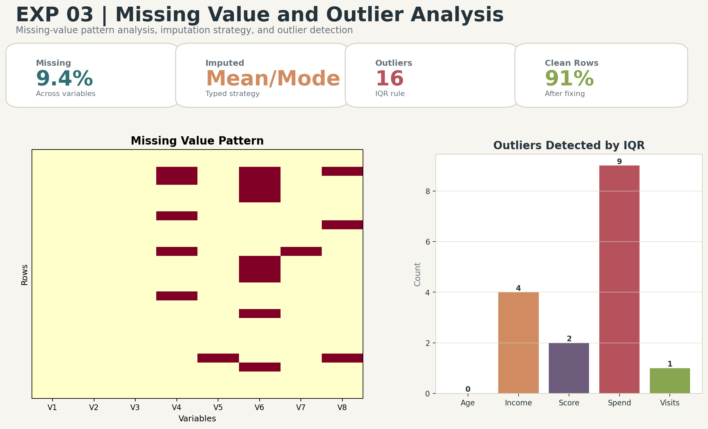
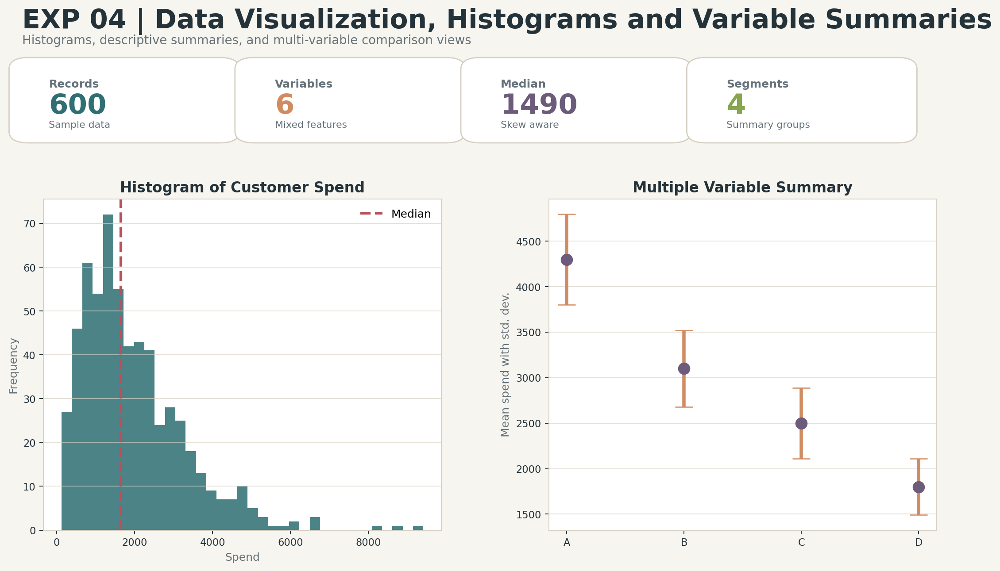
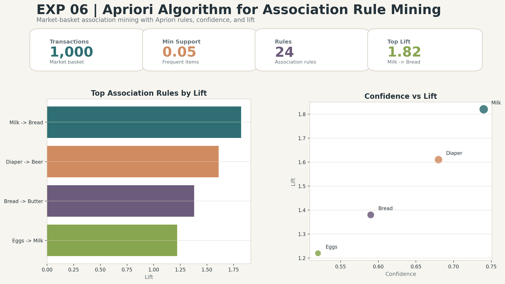

# Predictive and Prescriptive Analytics Experiments

Professional analytics lab repository with reproducible notebooks, clean documentation, and enhanced visual result artifacts.

## Experiments

| No. | Experiment | Dataset | Status |
| --- | --- | --- | --- |
| 1 | [Clustering Based Data Analytics using K-Means and SOM](EXP-01-Clustering-KMeans-SOM/) | Iris dataset or customer segmentation dataset | Added |
| 2 | [Descriptive Statistics and Distribution Analysis](EXP-02-Descriptive-Statistics-Distributions/) | Synthetic business dataset | Added |
| 3 | [Missing Value and Outlier Analysis](EXP-03-Missing-Values-Outlier-Analysis/) | Synthetic retail/customer dataset | Added |
| 4 | [Data Visualization, Histograms and Variable Summaries](EXP-04-Data-Visualization-Summaries/) | Synthetic sales analytics dataset | Added |
| 5 | [Transformation, Scaling, Binning, Skew Fixing and Sampling](EXP-05-Transformation-Scaling-Binning-Sampling/) | Synthetic customer value dataset | Added |
| 6 | [Apriori Algorithm for Association Rule Mining](EXP-06-Apriori-Association-Rules/) | Market basket transaction dataset | Added |
| 7 | [Linear and Logistic Regression](EXP-07-Linear-Logistic-Regression/) | Diabetes regression and breast cancer classification datasets | Added |
| 8 | [Predictive Models: Decision Tree, Neural Network and KNN](EXP-08-DecisionTree-NeuralNetwork-KNN/) | Breast cancer classification dataset | Added |
| 9 | [Temporal Mining Techniques](EXP-09-Temporal-Mining-Techniques/) | Synthetic monthly demand time series | Added |
| 10 | [Predictive Analytics for Microarray Data](EXP-10-Microarray-Predictive-Analytics/) | Microarray gene expression dataset or synthetic high-dimensional gene-expression sample | Added |

## Enhanced Visual Output Previews

| Experiment | Preview |
| --- | --- |
| [Clustering Based Data Analytics using K-Means and SOM](EXP-01-Clustering-KMeans-SOM/) |  |
| [Descriptive Statistics and Distribution Analysis](EXP-02-Descriptive-Statistics-Distributions/) |  |
| [Missing Value and Outlier Analysis](EXP-03-Missing-Values-Outlier-Analysis/) |  |
| [Data Visualization, Histograms and Variable Summaries](EXP-04-Data-Visualization-Summaries/) |  |
| [Transformation, Scaling, Binning, Skew Fixing and Sampling](EXP-05-Transformation-Scaling-Binning-Sampling/) |  |
| [Apriori Algorithm for Association Rule Mining](EXP-06-Apriori-Association-Rules/) |  |

More output images are available inside each experiment folder.

## Repository Structure

```text
Predictive-and-prescriptive-analytics/
|-- EXP-01-Clustering-KMeans-SOM/
|   |-- code.ipynb
|   |-- output.txt
|   |-- results/
|   `-- README.md
|-- EXP-02-Descriptive-Statistics-Distributions/
|-- ...
|-- EXP-10-Microarray-Predictive-Analytics/
|-- LICENSE
|-- requirements.txt
`-- README.md
```

## Standard Folder Layout

```text
EXP-XX-Experiment-Name/
|-- code.ipynb
|-- output.txt
|-- results/
|   |-- enhanced dashboard image
|   |-- metrics or reports
`-- README.md
```

## How to Run

1. Open an experiment folder.
2. Launch `code.ipynb` in Google Colab or Jupyter.
3. Run all cells.
4. Review regenerated files under `results/`.

## Notes

- The notebooks use compact reproducible datasets or standard public datasets.
- The included PNG files are enhanced sample outputs for presentation and lab-report use.
- Running notebooks regenerates metrics and output artifacts using live execution.
